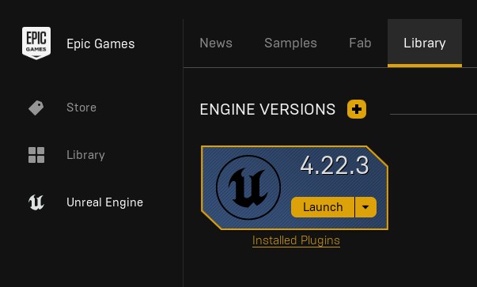

# Installing Unreal Engine

This project is built in **Unreal Engine 4.22.3**.

1. Download and install the [Epic Games Launcher](https://store.epicgames.com/en-US/download).
2. Launch the Epic Games Launcher, and log in.
3. Navigate to `Unreal Engine -> Library -> Engine Versions`
4. Click the `+` icon and select version **4.22.3**
5. Press `Install`. Once prompted with *Installation Options*, ensure the following is selected:
    - Core Components
    - Engine Source

    The following are purely optional, but are helpful if you need some resources for learning the basics of Unreal Engine.
    - (Optional) Starter Content
    - (Optional) Templates and Feature Packs

    
6. Once installed, you should see Engine Version 4.22.3 available and ready to launch.

    

---
### NEXT STEP: [Installing Visual Studio 2017](InstallingVisualStudio.md)

### BACK: [First Time Setup](FirstTimeSetup.md)