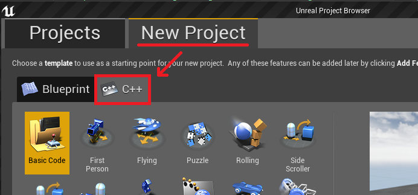

# Installing Visual Studio

All C++ scripts in this project are written and compiled using **Visual Studio 2017**. Unreal Engine comes with direct installers for Visual Studio.

1. Launch Unreal Engine 4.22.3. Select `New Project -> C++`.

    
2. You'll notice a **Install Visual Studio 2017** button at the bottom of the screen. Press it to initialize the Visual Studio 2017 installer.
3. Follow the onscreen instructions until you are prompted on what options to install. Ensure the following are selected:
- **WORKLOADS**  
    [X] Game development with C++
- **INDIVIDUAL COMPONENTS**  
    [X] C++ profiling tools  
    [X] Visual C++ tools for CMake  
    [X] VC++ 2017 version 15.9 v14.16 latest v141 tools  
    [X] Windows 10 SDK (*pick the latest available version*)
- **REMOVE**  
    Feel free to remove the following to avoid bloated space. You can always re-download these later if desired.  
    [-] Windows 8.1 SDK  
    [-] Unreal Engine Installer (you already have it)
4. Proceed with installation instructions.

---
### BACK: [First Time Setup](FirstTimeSetup.md)